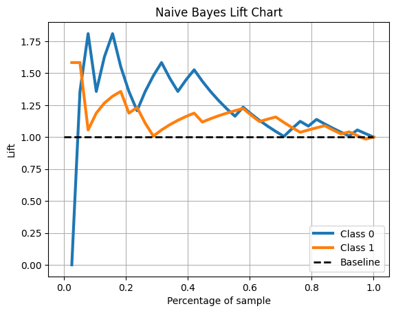
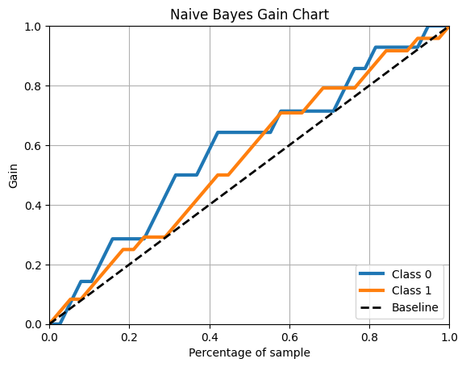
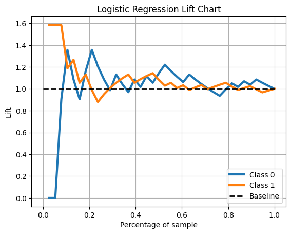
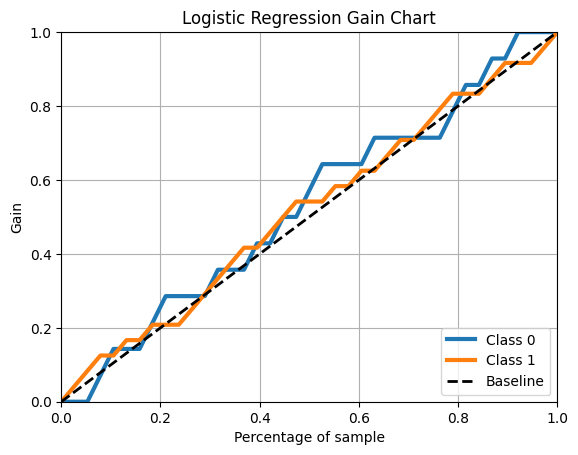

# Assignment 2 - Generative vs Discriminative Models

I chose to complete the assignment using the Gentoo and Chinstrap penguins.

## 1. Accuracy Comparison

The Naive Bayes model had an accuracy of 65.8% while Logistic Regression had an accuracy of 60.5%. Using accuracy as a metric, Naive Bayes seems to perform better at binary classification with this data. Neither model performed very well due to the size of the data, and the task itself. With more data, Logistic Regression most likely would have outperformed Naive Bayes. 

## 2. AUC Comparison

The Naive Bayes model had an AUC of 0.640, meaning the model was able to fit to the data and perform better than randomly guessing between the two penguin species. Logistic Regression only had an AUC of 0.545, which was slightly better than randomly guessing. This means that the Naive Bayes model performed much better than the Logistic Regression model.

## 3. Lift and Gain Charts

The Naive Bayes Lift and Gain charts show a greater area above the baseline compared to the Logistic Regression Lift and Gain charts. This shows that the Naive Bayes was the better model.

## 4. Model Performance Comparison

Since the Naive Bayes model outperformed the Logistic Regression model in accuracy, AUC, and Lift/Gain charts, Naive Bayes was overall the better model. The Logistic Regression model seemed to only be slightly better than guessing randomly based on the AUC and Lift/Gain charts. The Naive Bayes model was able to understand the data and perform much better than randomly guessing based on the AUC and Lift/Gain charts.

## 5. Performance on Complex Dataset

Using a much larger image dataset (MNIST), the accuracy and AUC metrics were computed:
- Naive Bayes Accuracy: 0.556
- Naive Bayes AUC: 0.932
- Logistic Regression Accuracy: 0.926
- Logistic Regression AUC: 0.994

This shows that the Logistic Regression model significantly outperformed the Naive Bayes model. The Naive Bayes model did seem to learn and perform much better than guessing randomly between the 10 classes, but it struggled to accurately predict on the dataset. Logistic Regression is a discriminative model that performs well on large classification tasks such as MNIST. With a 93% accuracy and a 0.994 AUC, this model was nearly perfect in this multi-class task. Since Naive Bayes is a generative model, it may have made too many assumptions with the large dataset.